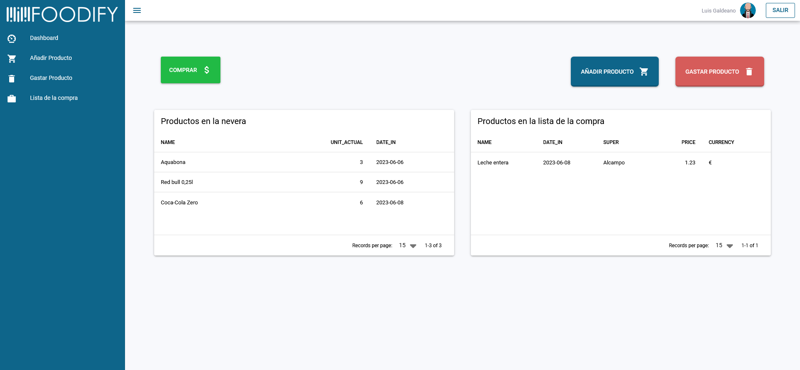

  

# Foodify  
### Aplicación para ahorrar tiempo comprando de manera eficiente
---

## Descripción
Foodify es una aplicación que te permite llevar un registro de los productos que compras en el supermercado, para que una vez que los hayas consumido, puedas obtener en un solo click el supermercado en el que ese producto tiene el precio más barato, con un enlace de compra que te permita optimizar tu cesta de la compra sin salir de casa.

Esto es un MVP, y en proximas actualizaciones se irán añadiendo nuevas funcionalidades.
  
## Instalación
Debido a su practicidad y sencillez, todas las dependencias de Foodify han sido gestionadas con Poetry, por lo que para realizar una instalación exitosa solo debes seguir los siguientes pasos:
  
1. Configurar un entorno virtual para instalar Foodify.
2. Clonar el repositorio en la ruta deseada.
3. Instalar Poetry en tu entorno virutal.
    ~~~python
    pip install poetry
    ~~~    
    
4. Instalar las dependencias necesarias para el proyecto con Poetry.
    ~~~python
    potry install
    ~~~    

Esto instalará todas las dependencias necesarias para que la aplicación funcione correctamente.

## Frontend

El Frontend se ha realizado mediante VueJS y se ha subido en un repositorio diferente. Si deseas tener la aplicación completamente funcional has de tener corriendo tanto el Frontend como el Backend

URL del Frontend:

[Foodify - Frontend](https://github.com/LuisGaldeano/Foodify_Frontend)
    
## Requisitos
Para poder usar Foodify correctamente es necesario contar con:

* Una webcam conectada al equipo como cámara principal
* Poetry

## Uso de Foodify
Foodify se divide en cuatro partes con diferentes funcionalidades:

  

### 1. **Dashboard:**
La página principal de la aplicación, en donde se muestra todo lo que hay en la nevera y todo lo que se ha añadido a la lista de la compra.
En esta página también se muestran los diferentes botones que permiten moverse a través de la aplicación. Estos son:
    
   1. <u>Añadir Producto:</u>  Redirecciona a la página en la que se realizarán los registro de los productos que se hayan adquirido por primera vez.
    
   2. <u>Gastar Producto:</u>  Redirecciona a la página en la que se realiza el escaneo de los productos que se hayan consumido.
    
   3. <u>Comprar:</u>  Redirecciona a la página en la que se muestra la lista de la compra con los productos que hemos consumido junto al precio más barato de los supermercados especificados y un enlace de compra.
    
  

### 2. Añadir Producto:

En esta página es donde se realiza el registro de productos nuevos. Para ello, con la cámara se escanea el código de barras de cada producto debiendo indicar los siguientes aspectos:

   * Unidades por paquete:  Lugar donde se ha de indicar el número de unidades individuales que tiene cada paquete del producto. (Ej: Los yogures normalmente vienen en pack de 4, por lo que habría que poner 4 en esta opción.)

   * Recurrente:  Se han de marcar como recurrente los productos que una vez gastados se van a volver a comprar, mientras que para los productos que se compran de manera esporádica se ha de desmarcar esta opción para que una vez que se gasten no se envíen a la lista de la compra.
   
  

### 3. Gastar Producto:

En esta página se llevará a cabo el registro de los productos gastados. Para ello con la cámara se escaneará el código de barras del producto antes de tirarlo a la basura. 
Una vez que se haya consumido la última unidad, si fue marcado como recurrente se añadirá a la lista de la compra, indicando el precio más barato de los supermercados establecidos.

**Actualizar Precios**

Todas las noches está programado una actualización de los precios de todos los productos que hay en la base de datos. Dado que es un proceso largo que puede llevar mucho tiempo, esta tarea ha sido programada para que se ejecute a la 1 de la madrugada.

Sin embargo, si fuera necesario actualizar los precios manualmente se puede realizar mediente el botón de "Actualizar Precios". Aunque hay que tener en cuenta que si la base de datos de productos es muy extensa, este proceso puede alargarse en el tiempo.

  

### Lista de la compra:

Por último, en esta página se muestran los enlaces de compra de los productos que se han incluido en la lista de la compra, así como el precio de los mismos y el supermercado en el que el precio es más barato.

Dado que es un MVP, estos productos deberán comprarse manualmente siguiendo el enlace generado, y una vez adquiridos se deberá pulsar el botón de "Comprar". Esto enviará los productos desde la lista de la compra de nuevo a la nevera, por lo que una vez escaneado un producto comprado la primera vez, ya no será necesario volver a escaneralo.

De igual manera, si se desea descargar una lista de la compra en formato PDF, puede realizarse pulsando el botón de "Descargar PDF", lo que generará un documento con la lista de la compra, indicando la fecha en la que se ejecutó.

Este documento se guardará en la carpeta PDF de la ruta de la aplicación.

### Conclusión:

Espero que el proyecto te haya parecido interesante y puedas usarlo para gestionar tus compras de manera eficiente.

Para su realización se ha utilizado:
    Python, SQLAlchemy, PostgreSQL, OpenCV, VueJS y otras librerías especializadas.
    
### Licencia:

El proyecto está desarrollado bajo licencia MIT.
